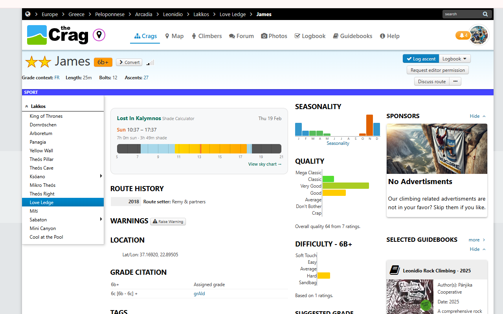
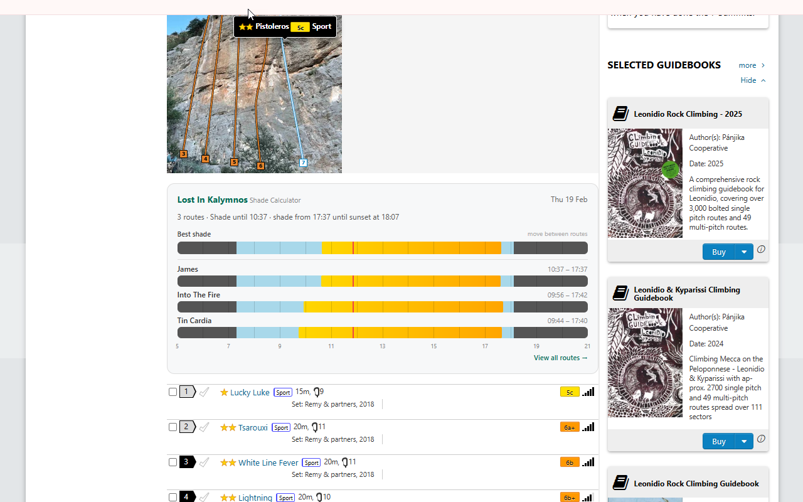
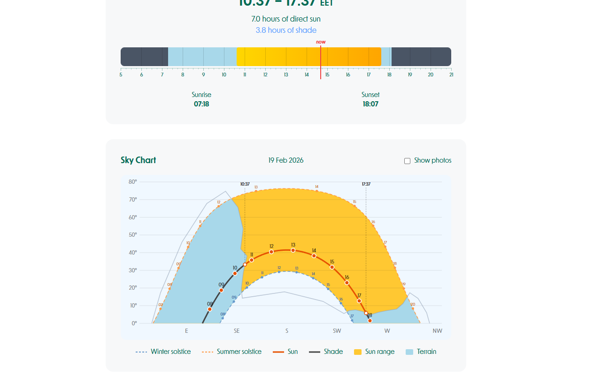

# SunShade — Shade on theCrag

A Chrome extension that shows sun and shade times for climbing routes on [theCrag.com](https://www.thecrag.com), powered by the [SunShade](https://sunshade.info) platform.

## What it does

When you browse a route or area on theCrag that has a shade profile, the extension injects a panel showing:

**On route pages:**
- Sun intervals (e.g. 09:51 – 15:35)
- Total sun and shade hours
- Timeline bar with current time indicator
- Link to the full sky chart

**On area pages:**
- Shade summary for the crag
- "Best shade" composite bar (move between routes to maximise shade)
- Individual route bars with sun times
- Link to crag overview

If a route doesn't have a shade profile, nothing is shown — the extension is invisible.

## Covered areas

Shade profiles currently cover **Leonidio** and **Kalymnos** (Greece), with Kalymnos coverage growing steadily. Browse every covered route at [sunshade.info/thecrag](https://sunshade.info/thecrag).

## Install

1. Download or clone this repository
2. Open Chrome and go to `chrome://extensions`
3. Enable **Developer mode** (toggle in top-right)
4. Click **Load unpacked** and select this folder
5. Browse any route or area on theCrag — the shade panel appears automatically

## How it works

Each route has a **terrain profile**: a 360° horizon silhouette captured at the actual climbing location, mapping out the mountains, cliffs and ridges that block the sun. The extension fetches the profile from the [SunShade API](https://sunshade.info), computes today's solar path with [SunCalc](https://github.com/mourner/suncalc), and intersects the two in your browser — so you get shade times specific to each route, not just generic sunrise/sunset.

## Screenshots

**Route page** — shade panel on a theCrag route:

**Area page** — crag overview with bars for all routes:

**Sky chart** — the extension links each route to its full sky chart on sunshade.info:

## Links

- [SunShade — sun and shade predictions for any outdoor location](https://sunshade.info)
- [All covered theCrag routes](https://sunshade.info/thecrag)
- [Lost In Kalymnos — Kalymnos climbing guide](https://lostinkalymnos.com)

## License

[MIT](LICENSE) — David Linton
